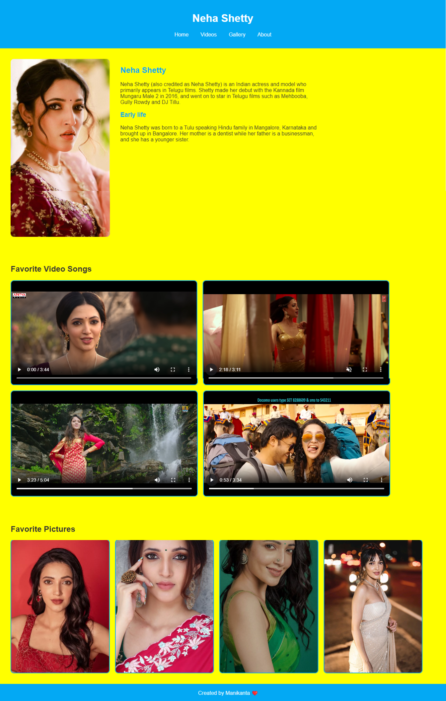

# Neha Shetty Fan Page

This project is a fan page dedicated to the Indian actress Neha Shetty. It is created using only HTML and CSS. The page includes a header, a section with Neha Shetty's profile picture and biography, a section with favorite video songs, a gallery of favorite pictures, and a footer with the creator's name and a heart.

## Table of Contents

- [Video](#video)
- [Features](#features)
- [Technologies Used](#technologies-used)
- [Setup](#setup)
- [Usage](#usage)

## Screenshots




## Video

Here is a video demonstrating how the webpage looks by scrolling down:


https://github.com/Manikanta-484/Neha-Shetty/assets/149045195/b45af00f-a521-4da3-9614-ef308b4e3961

## Features

- **Header:** Contains the fan page title and a navigation bar.
- **Profile Section:** Displays a profile picture of Neha Shetty and a short biography.
- **Favorite Videos:** Showcases four favorite video songs of Neha Shetty.
- **Gallery:** A gallery section with favorite pictures of Neha Shetty.
- **Footer:** Includes the creator's name (Manikanta) and a heart.

## Technologies Used

- HTML
- CSS

## Setup

To run this project locally, follow these steps:

1. Clone the repository:
    ```bash
    git clone https://github.com/Manikanta-484/neha-shetty-fan-page.git
    ```
2. Navigate to the project directory:
    ```bash
    cd neha-shetty-fan-page
    ```
3. Open `index.html` in your web browser.

## Usage

You can customize the fan page by changing the content in the `index.html` file and the styles in the `styles.css` file. For example, you can add more videos or pictures, or update the biography.

### Adding Videos

To add your own video files, place them in the project directory and update the video source tags in the HTML:

```html
<video controls>
    <source src="your-video-file.mp4" type="video/mp4">
    Your browser does not support the video tag.
</video>
